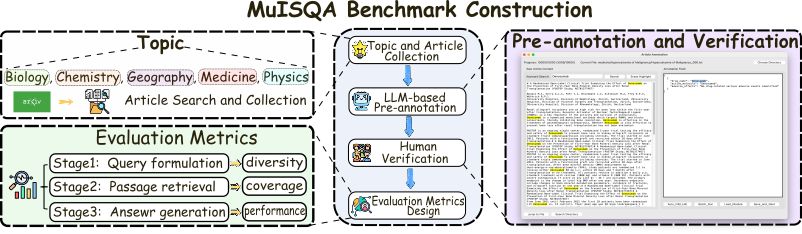
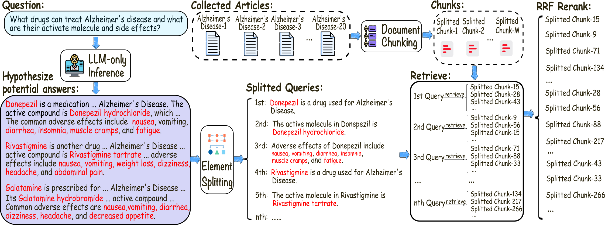
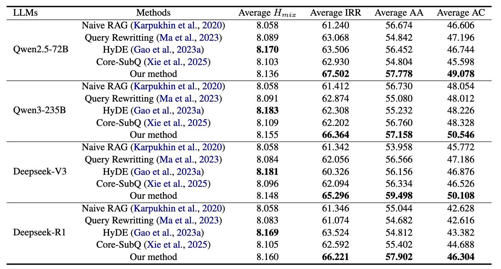
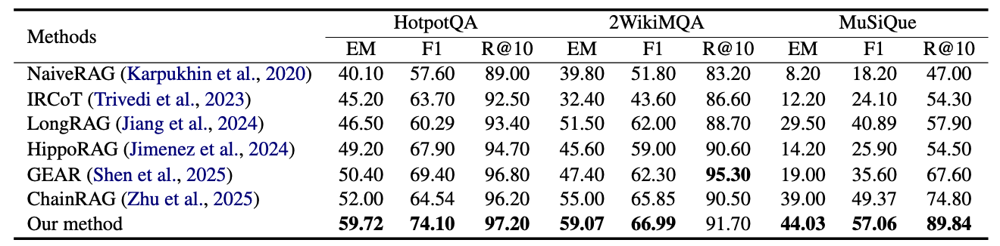
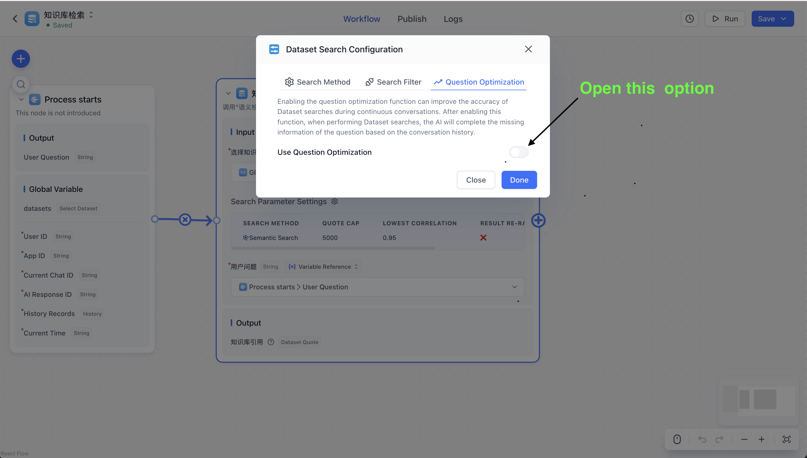
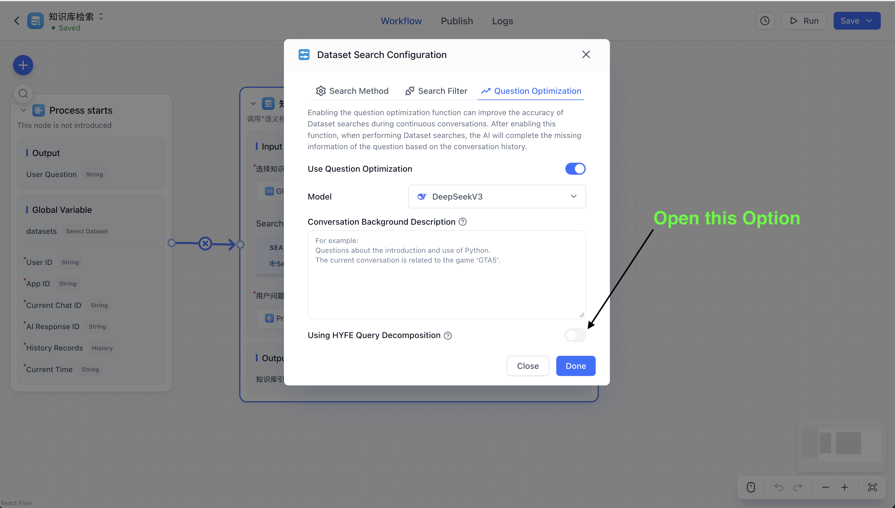
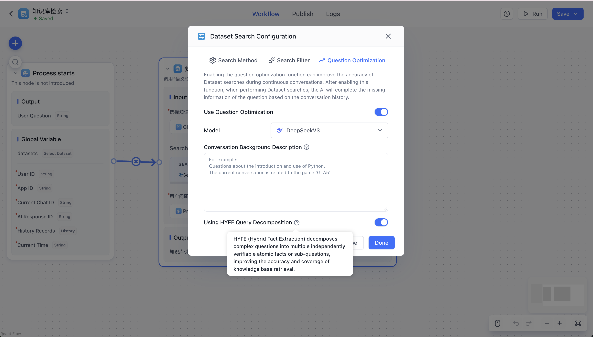

<h1 align="center"> MuISQA: Multi-Intent Retrieval-Augmented Generation for Scientific Question Answering</h1>

# MuISQA

MuISQA is a RAG project built by modifying and testing on FastGPT, and its main contributions can be divided into two parts:
 1. Multi-Intent Scientific Question Answering (MuISQA) benchmark
 2. Intent-aware retrieval framework
    
We also clarify that our project does not affect FastGPT’s copyright or any related rights; it is solely an experimental study conducted for RAG research purposes.


## 🛸 Introduction

<div align="center">
 
[**Zhiyuan Li**](https://scholar.google.com/citations?user=vdrrpk8AAAAJ&hl=en)<sup></sup> · [**Haisheng Yu**](https://www.linkedin.com/in/%E6%B5%B7%E7%94%9F-%E4%BA%8E-238a80103)<sup></sup> · [**Guangchuan Guo**](https://www.linkedin.com/in/%E5%B9%BF%E5%B7%9D-%E9%83%AD-04155511b/)<sup></sup> · [**Nan Zhou**](https://www.linkedin.com/in/%E5%8D%97-%E5%91%A8-63389738a/)<sup></sup> · [**Jiajun Zhang**](https://scholar.google.com/citations?user=93zngeYAAAAJ&hl=en)<sup></sup>
</div>

<p align="center">
  	<b>
    [<a href="https://arxiv.org/abs/2511.16283">ArXiv</a>] | [<a href="https://huggingface.co/datasets/Pinkygin/MuISQA">🤗HuggingFace</a>]
    </b>
    <br/>
</p>

Complex scientific questions often entail multiple intents, such as identifying gene mutations and linking them to related diseases. These tasks require evidence from diverse sources and multi-hop reasoning, while conventional retrieval-augmented generation (RAG) systems are usually single-intent oriented, leading to incomplete evidence coverage. To assess this limitation, we introduce the Multi-Intent Scientific Question Answering (MuISQA) benchmark, which is designed to evaluate RAG systems on heterogeneous evidence coverage across sub-questions. In addition, we propose an intent-aware retrieval framework that leverages large language models (LLMs) to hypothesize potential answers, decompose them into intent-specific queries, and retrieve supporting passages for each underlying intent. The retrieved fragments are then aggregated and re-ranked via Reciprocal Rank Fusion (RRF) to balance coverage across diverse intents while reducing redundancy. Experiments on both MuISQA benchmark and other general RAG datasets demonstrate that our method consistently outperforms conventional approaches, particularly in retrieval accuracy and evidence coverage.

## 💡 MuISQA benchmark

<p align="left">
  
</p>

## 💪 Intent-aware retrieval framework

<p align="left">
  
</p>

## 👀 Performance

#### Performance on MuISQA Benchmark

<p align="left">
  
</p>

#### Performance on Multi-hop Benchmarks

<p align="left">
  
</p>

## 🌿 Implement

Our project is developed on top of **FastGPT v4.9.13**. In this section, we describe in detail how to deploy our system.

#### Step 1:
```
git clone https://github.com/Zhiyuan-Li-John/MuISQA.git
```

#### Step 2:
Please refer to the FastGPT local development documentation and complete the corresponding installation steps:
[Quick Start for Local Development](https://doc.tryfastgpt.ai/docs/development/intro/)

More FastGPT documentation:
* [System Configuration Guide](https://doc.tryfastgpt.ai/docs/development/configuration/)
* [Multi-Model Configuration](https://doc.tryfastgpt.ai/docs/development/modelconfig/one-api/)
* [Version Upgrade Instructions](https://doc.tryfastgpt.ai/docs/development/upgrading/)
* [OpenAPI Documentation](https://doc.tryfastgpt.ai/docs/development/openapi/)
* [Knowledge Base & RAG Structure](https://doc.tryfastgpt.ai/docs/guide/knowledge_base/rag/)

#### Step 3:
Our intent-aware retrieval framework has already been integrated into FastGPT. To enable and use it, please follow the steps below:
<p align="left">
  
</p>
<p align="left">
  
</p>
<p align="left">
  
</p>

## Reference
If you find this project useful for your research, please consider citing the following paper:

```
@article{li2025muisqa,
  title={MuISQA: Multi-Intent Retrieval-Augmented Generation for Scientific Question Answering},
  author={Li, Zhiyuan and Yu, Haisheng and Guo, Guangchuan and Zhou, Nan and Zhang, Jiajun},
  journal={arXiv preprint arXiv:2511.16283},
  year={2025}
}
}
```
